::: {align="center"}
# 🚀 Syncora

### Collaborative Workspace & Task Management Platform

```{=html}
<p>
```
A modern full-stack productivity platform featuring real-time
collaboration, Kanban workflow management, analytics dashboards,
notifications, and a polished responsive interface.
```{=html}
</p>
```
```{=html}
<p>
```
`<a href="https://syncora-work.vercel.app">`{=html}``{=html}`</a>`{=html}
`<a href="https://syncora-asng.onrender.com/health">`{=html}``{=html}`</a>`{=html}

```{=html}
</p>
```
```{=html}
<p>
```
``{=html}

```{=html}
</p>
```
:::

------------------------------------------------------------------------

# 🎥 Product Walkthrough

> **Demo video coming soon**

After recording your walkthrough:

1.  Upload it to **YouTube (recommended)**.
2.  Replace this section with:

``` md
[](https://youtu.be/YOUR_VIDEO_ID)
```

------------------------------------------------------------------------

# ✨ Highlights

-   🔐 Secure JWT Authentication
-   📋 Kanban Task Management
-   ⚡ Real-time Notifications (Socket.IO)
-   📈 Analytics Dashboard
-   🌙 Light & Dark Themes
-   🔍 Search & Filtering
-   📱 Responsive Design
-   🗄 PostgreSQL + Prisma ORM
-   ☁️ Production Deployment (Vercel + Render + Neon)

------------------------------------------------------------------------

# 📸 Application Preview

## Authentication

  Login                        Register
  ---------------------------- -------------------------------
  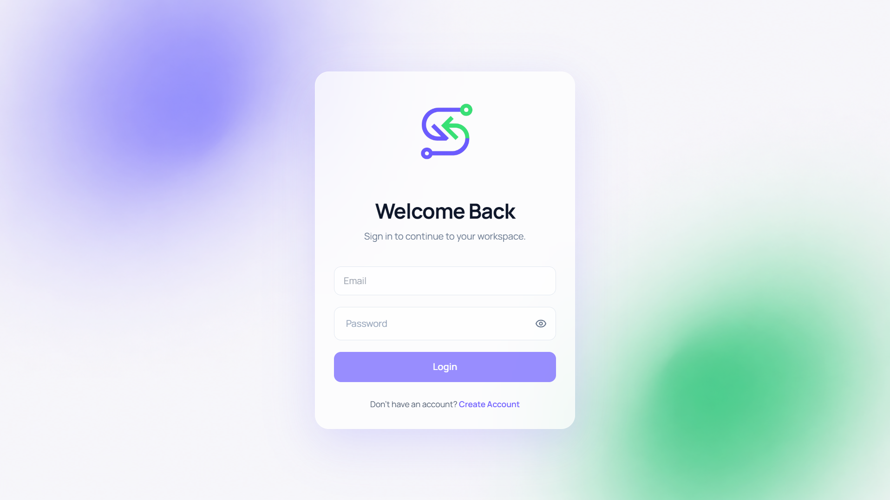   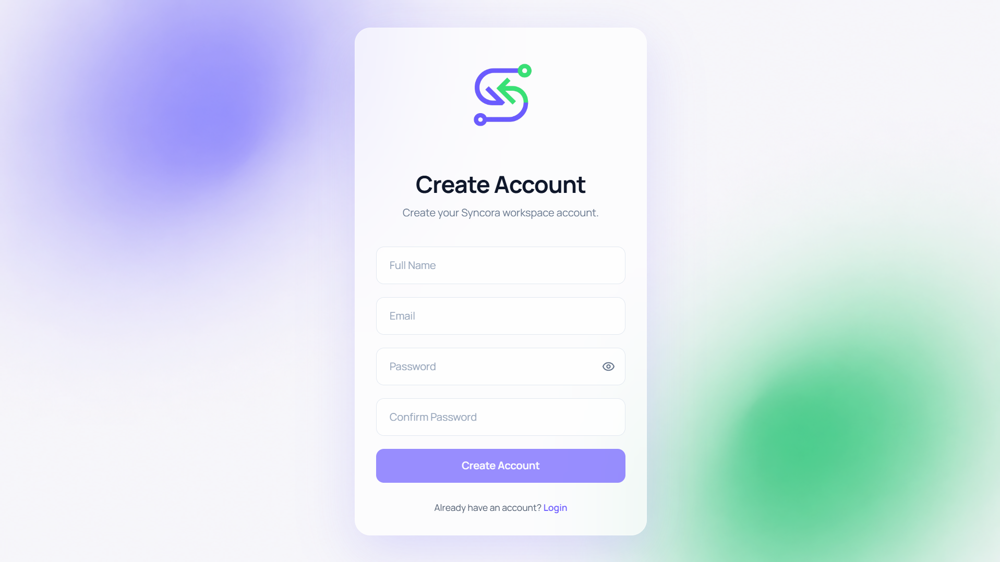

------------------------------------------------------------------------

## Dashboard

  ----------------------------------------------------------------------------
  Light                                  Dark
  -------------------------------------- -------------------------------------
  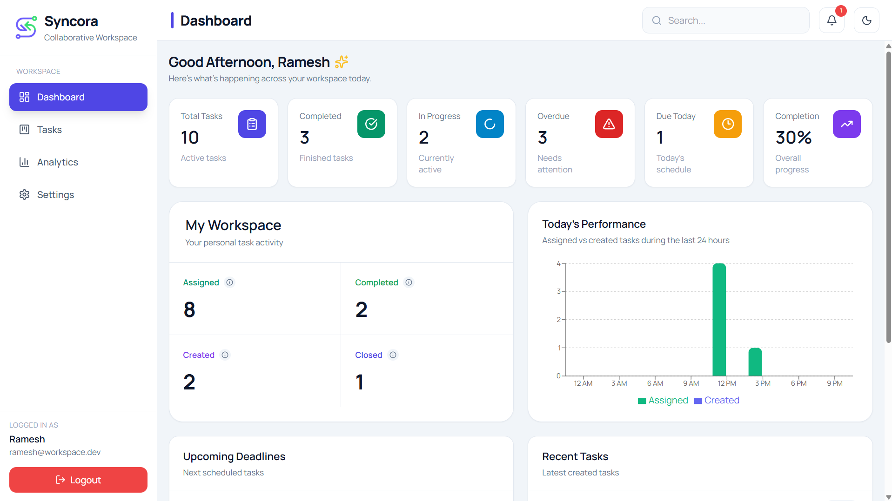   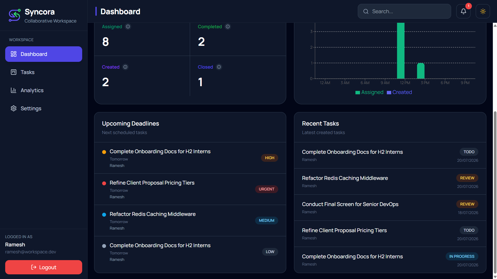

  ----------------------------------------------------------------------------

------------------------------------------------------------------------

## Kanban Workspace

  Light                               Dark
  ----------------------------------- ----------------------------------
  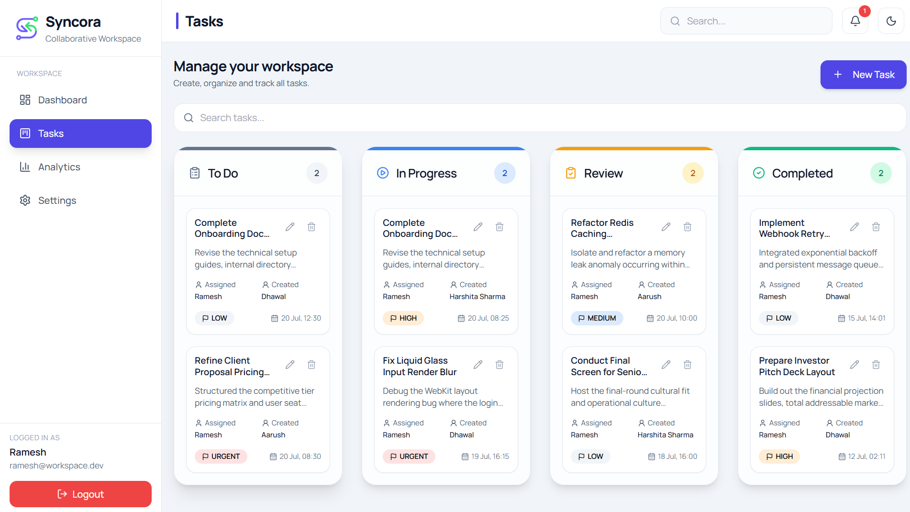   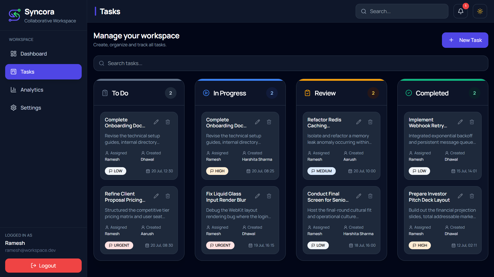

------------------------------------------------------------------------

## Analytics

  ----------------------------------------------------------------------------
  Light                                  Dark
  -------------------------------------- -------------------------------------
  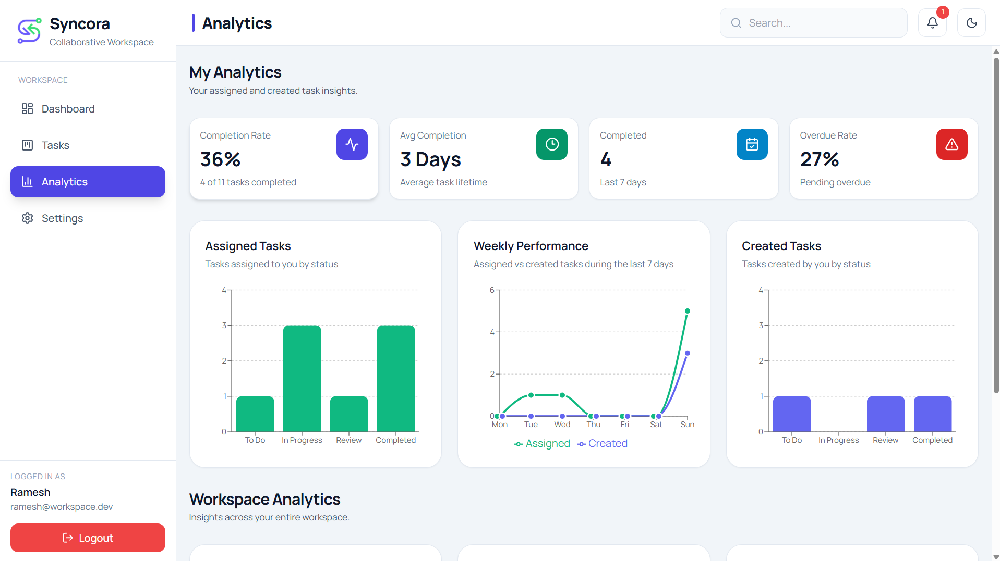   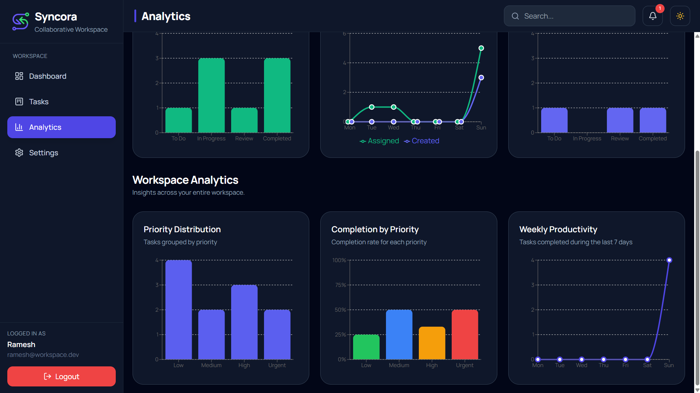

  ----------------------------------------------------------------------------

------------------------------------------------------------------------

## Task Details

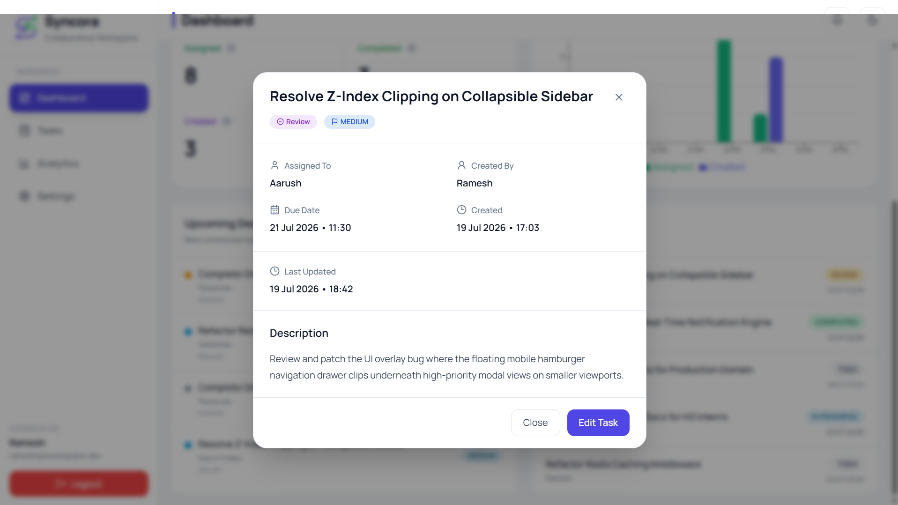

------------------------------------------------------------------------

## Notifications

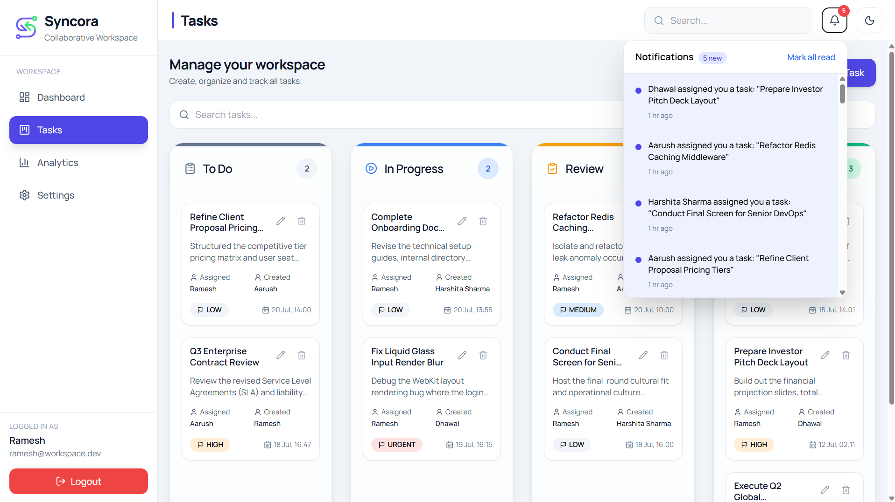

------------------------------------------------------------------------

## Profile Settings

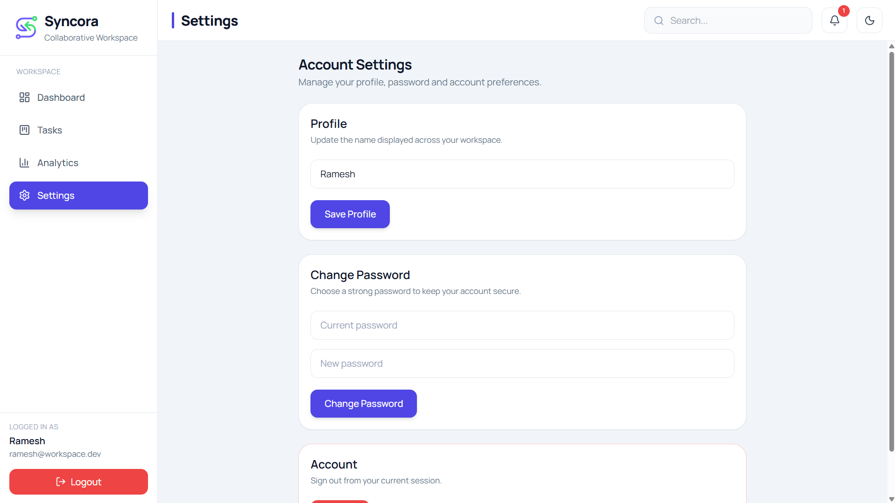

------------------------------------------------------------------------

# 🏗 System Architecture

``` text
                 React + TypeScript
                         │
              React Query + Router
                         │
                    REST API
                         │
        Express.js + Prisma ORM
               │                 │
        PostgreSQL          Socket.IO
               │                 │
            Neon DB      Real-time Events
```

------------------------------------------------------------------------

# 🧰 Technology Stack

## Frontend

``{=html}

React • TypeScript • Tailwind CSS • Vite • React Query • React Router •
Recharts

## Backend

``{=html}

Node.js • Express • Prisma ORM • PostgreSQL • JWT • Socket.IO

## Deployment

-   ▲ Vercel
-   🚀 Render
-   🐘 Neon PostgreSQL

------------------------------------------------------------------------

# 📂 Project Structure

``` text
Syncora
├── frontend/
├── backend/
├── screenshots/
├── README.md
└── LICENSE
```

------------------------------------------------------------------------

# 🚀 Live Deployment

  Service    URL
  ---------- -----------------------------------
  Frontend   https://syncora-work.vercel.app
  Backend    https://syncora-asng.onrender.com

------------------------------------------------------------------------

# 🌱 Future Enhancements

-   Team collaboration
-   Workspace invitations
-   Calendar integration
-   File attachments
-   Email notifications
-   AI task summaries
-   Activity timeline

------------------------------------------------------------------------

# 👨‍💻 Developer

**Dhawal Sarode**

GitHub: https://github.com/dhawalsarode

LinkedIn: *(Add your profile URL)*

------------------------------------------------------------------------

::: {align="center"}
### ⭐ If you like Syncora, consider giving the repository a star.

Built with ❤️ using React, TypeScript, Express and PostgreSQL.
:::
